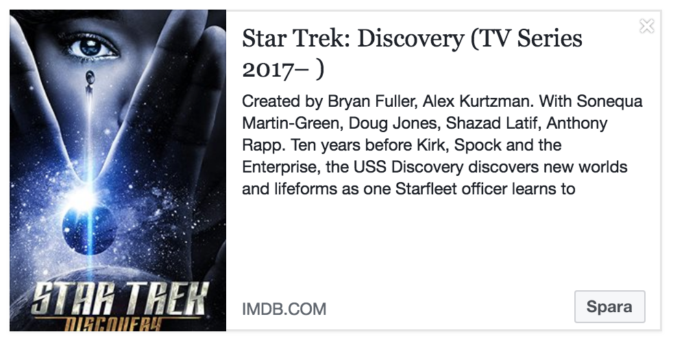

## Open Graph
In this section, we'll be adding some meta tags to your webpage to make it more easily shared on various social networks.

The Open Graph Protocol is a set of tags that allows developers to give major social networks (Facebook, Twitter, Linked in...) detailed information about its pages and content. This information is used by social networks to better display a link on those pages that have been placed by the users.

Is Open Graph relevant for Search Engine Optimization?

In theory, the impact of the Open Graph on SEO is limited. The protocol is intended primarily for social networks and not for search engines like Google, Bing, Yahoo, etc. In practice, however, the social networks, like Facebook for example, have become so important in recent years that the search engines can’t ignore the Open Graph data in their algorithms.

To add the Open Graph protocol, you must simply:

* Add the namespace "http://ogp.me/ns#" to the html tag
* Between the head tags, you must add the meta tags with their property and content attributes
* The specifications define 4 Open Graph tags like "Requirements" : og:title, og:type, og:url, og:image
* Other tags are also useful.


The four required properties for every page are:

* `og:title` - The title of your object as it should appear within the graph, e.g., "The Rock".
* `og:type` - The type of your object, e.g., "video.movie". Depending on the type you specify, other properties may also be required.
* `og:image` - An image URL which should represent your object within the graph.
* `og:url` - The canonical URL of your object that will be used as its permanent ID in the graph, e.g., "http://www.imdb.com/title/tt0117500/".
* (optional but good to include) `og:description` - A short description or summary of the object. Between 2 and 4 sentences.


As an example, the following is the Open Graph protocol markup for the movie The Rock on IMDB:

```html
<html prefix="og: http://ogp.me/ns#">
  <head>
    <title>Star Trek: Discovery (TV Series 2017– )</title>
    <meta property='og:title' content="Star Trek: Discovery (TV Series 2017– )" />
    <meta property='og:type' content="video.tv_show" />
    <meta property='og:image' content="https://ia.media-imdb.com/images/M/MV5BMjM3NDA1NjM1Nl5BMl5BanBnXkFtZTgwNzg5ODEzMzI@._V1_UY1200_CR96,0,630,1200_AL_.jpg" />
    <meta property="og:url" content="http://www.imdb.com/title/tt5171438/" />
    <meta property="og:description" content="Ten years before Kirk, Spock and the Enterprise, the USS Discovery discovers new worlds and lifeforms as one Starfleet officer learns to understand all things alien." />
    ...
  </head>
  <body>
  ...
  </body>
</html>
```



## Twitter

Twitter card tags look similar to Open Graph tags, and are based on the same conventions as the Open Graph protocol.

Twitter has its own <meta> tags that are similar to the Open Graph protocol, but uses the `twitter:` prefix instead of `og`. As with Facebook, only a few are required, but for the sake of brevity, we can leverage the fact that Twitter allows us to substitute the Open Graph `<meta>` tags for its own.

In practical terms, the only tag we need to add, to be in control of how Twitter displays our site is the `twitter:card` tag that specifies the card type, which will be one of “summary”, “summary_large_image”, “app”, or “player”.

More information (advanced) can be found at http://ogp.me/
